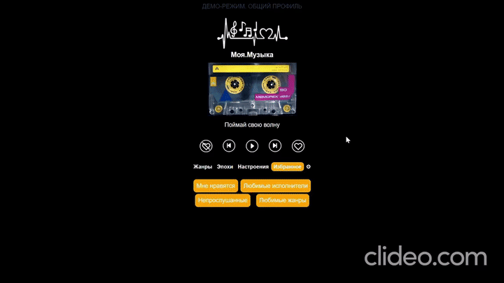
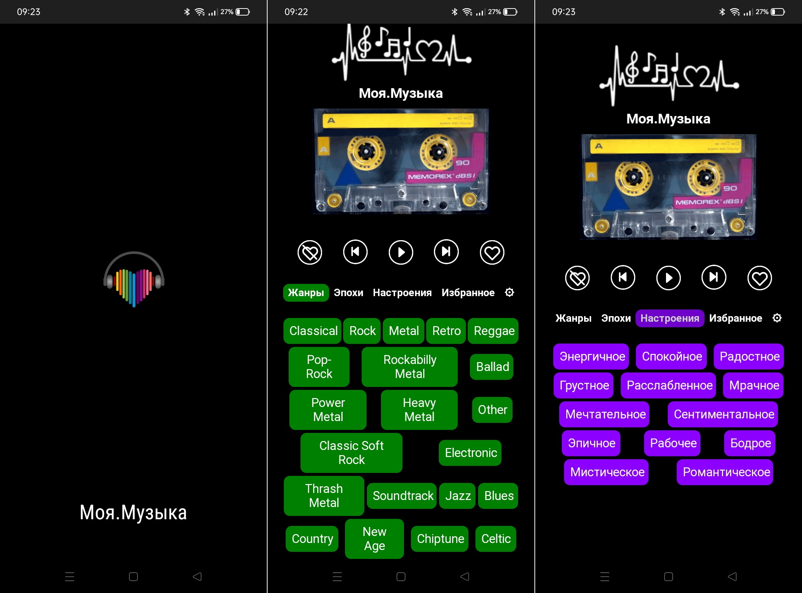
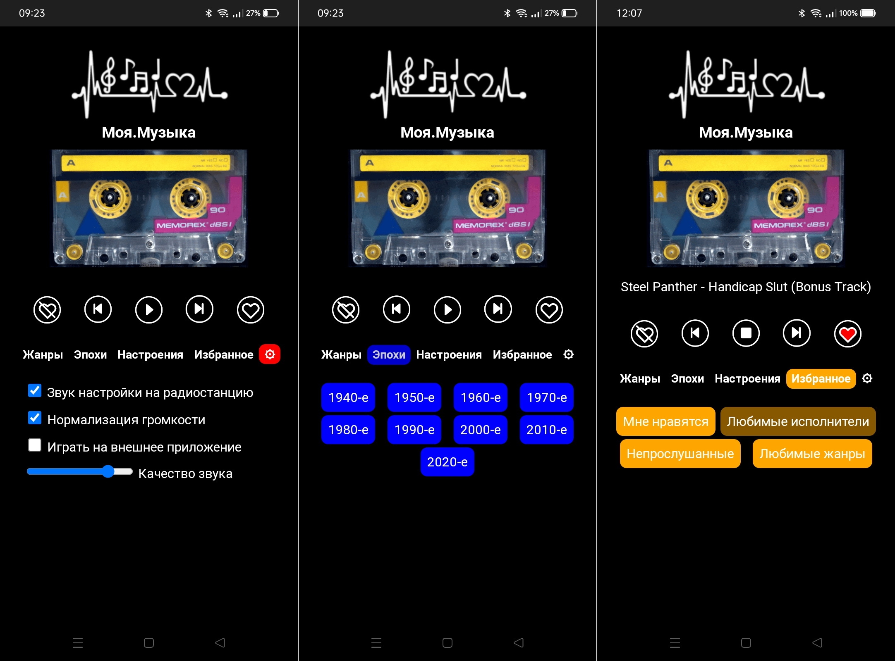

# Моя.Музыка

Frontend стримингового сервиса "Моя.Музыка".
Используется Vue3/Vuex.

Backend здесь https://github.com/darkavengersmr/MyMusic

Реализованы:
- регистрация и авторизация, демо-режим
- управление воспроизведением
- лайк/дислайк
- выбор жанра/эпохи/настроения
- избранное (любимые исполнители/жанры)
- отключаемый в настройках звук настройки на радиостанцию
- управление нормализацией громкости
- возможность настройки качества трансляции

